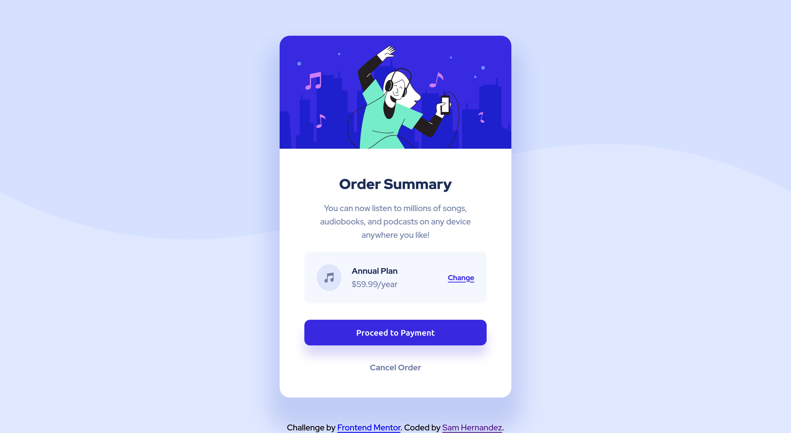

# Frontend Mentor - Order summary card solution

This is a solution to the [Order summary card challenge on Frontend Mentor](https://www.frontendmentor.io/challenges/order-summary-component-QlPmajDUj). Frontend Mentor challenges help you improve your coding skills by building realistic projects. 

## Table of contents

- [Overview](#overview)
  - [The challenge](#the-challenge)
  - [Screenshots](#screenshots)
  - [Links](#links)
- [My process](#my-process)
  - [Built with](#built-with)
- [Author](#author)

## Overview

### The challenge

Users should be able to:

- See hover states for interactive elements

### Screenshots

### Links

- Solution URL: [https://www.frontendmentor.io/solutions/order-summary-component-built-with-flexbox-s0scwX7SNg](https://www.frontendmentor.io/solutions/order-summary-component-built-with-flexbox-s0scwX7SNg)
- Live Site URL: [https://s067130h.github.io/order-summary-component-main/](https://s067130h.github.io/order-summary-component-main/)

## My process

### Built with

- Semantic HTML5 markup
- CSS custom properties
- Flexbox
- Mobile-first workflow

## Author

- Frontend Mentor - [@S067130H](https://www.frontendmentor.io/profile/S067130H)

